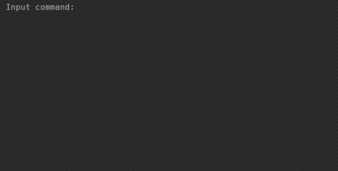

# Tic-Tac-Toe-with-AI 
Everybody remembers this paper-and-pencil game from childhood: Tic-Tac-Toe, also known as Noughts and Crosses or X's and O's. A single mistake usually costs you the game, but thankfully it's simple enough that most players discover the best strategy quickly. Let’s program Tic-Tac-Toe and create an AI opponent to do battle with!
